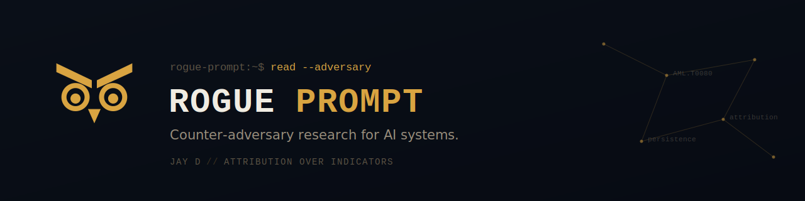
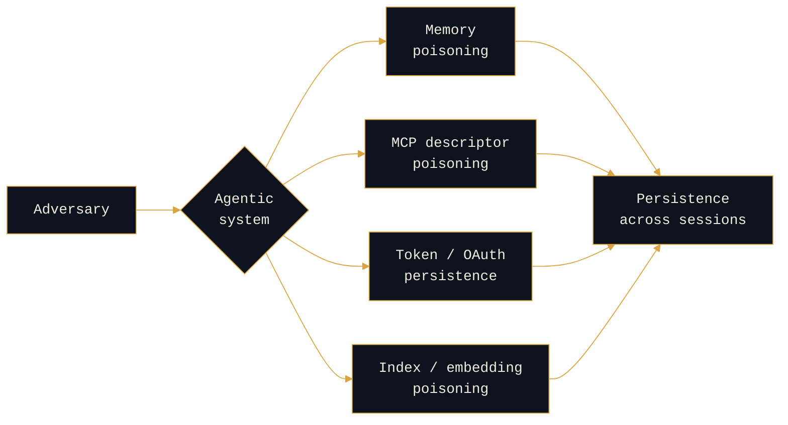

<div align="center">



<a href="https://rogue-prompt.com"></a>
<a href="https://rogueprompt.substack.com"></a>
<a href="https://linkedin.com/in/jayd-rogueprompt"></a>
<a href="https://bsky.app/profile/rogue-prompt.com"></a>

</div>

---

```console
rogue-prompt:~$ whoami
```

**Counter-adversary researcher for AI systems.**

The discipline is attribution: reading how LLM and agent deployments are attacked, and what the method reveals about the actor behind the prompt. Most are mapping the vulnerability. I read the context.

Everyone else is arriving at AI security from application security. I am arriving from the adversary.

---

```console
rogue-prompt:~$ cat research/persistence-typology
```

### How adversaries persist inside agentic systems



Four mechanisms, one outcome. The mechanism is the tell: each one implies a different level of access, patience, and intent, which is where attribution starts.

---

```console
rogue-prompt:~$ ls research/
```

| | |
|:---|:---|
| <a href="https://github.com/jay-rogueprompt/ai-adversary-research"></a> | How adversaries stay inside agentic systems after the initial compromise, and what each mechanism reveals about the actor. |
| <a href="https://github.com/jay-rogueprompt/ai-adversary-research"></a> | LLM attack paths mapped to courses of action (deny, degrade, disrupt, deceive), not just vulnerability classes. |
| <a href="https://github.com/jay-rogueprompt/ai-adversary-research"></a> | Why classifiers are not controls, and what a trusted computing base looks like for an agent. |
| <a href="https://github.com/jay-rogueprompt/ai-adversary-research"></a> | Attribution methodology carried from nation-state CTI onto a new surface. |

> **[ai-adversary-research](https://github.com/jay-rogueprompt/ai-adversary-research)** is where all of it lives.

---

<details>
<summary><b>rogue-prompt:~$ history</b></summary>

<br>

My background is adversary work, years working and leading Counter-adversary Operations teams on nation-state APTs, ransomware crews, and organized threat actors, until the tradecraft and the actor behind it were undeniable. Navy first, then CTI, with a contribution to the Verizon DBIR and support on two CISA #StopRansomware advisories along the way.

The attacks on AI systems, injected instructions, poisoned memory, the rogue prompt, are still early, so most of my work here is theory and hypothesis: running experiments, probing how these systems fail, and asking how you would attribute an attack on a model the way you would on a network. I work through it in the open, because I would rather test ideas in public and help build AI security into a real discipline than wait for the field to settle.

</details>

<details>
<summary><b>rogue-prompt:~$ cat open-questions</b></summary>

<br>

Research in progress, stated as open questions rather than settled answers. Provenance and confidence on every claim. See [open-questions.md](https://github.com/jay-rogueprompt/ai-adversary-research/blob/main/open-questions.md).

</details>

---

```console
rogue-prompt:~$ _
```
