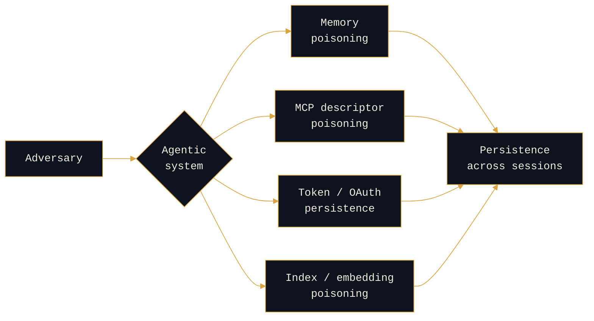

<div align="center">


<a href="https://rogue-prompt.com"></a>
<a href="https://rogueprompt.substack.com"></a>
<a href="https://linkedin.com/in/jayd-rogueprompt"></a>
<a href="https://bsky.app/profile/rogue-prompt.com"></a>

</div>

---

```console
rogue-prompt:~$ whoami
```

**Counter-adversary researcher for AI systems.**

The discipline is attribution: reading how LLM and agent deployments are attacked, and what the method reveals about the actor behind the prompt. Most are mapping the vulnerability. I read the context.

Everyone else is arriving at AI security from application security. I am arriving from the adversary.

---

```console
rogue-prompt:~$ cat research/persistence-typology
```

### How adversaries persist inside agentic systems



Four mechanisms, one outcome. The mechanism is the tell: each one implies a different level of access, patience, and intent, which is where attribution starts.

---

```console
rogue-prompt:~$ ls research/
```

| | |
|:---|:---|
| <a href="https://github.com/jay-rogueprompt/ai-adversary-research"></a> | How adversaries stay inside agentic systems after the initial compromise, and what each mechanism reveals about the actor. |
| <a href="https://github.com/jay-rogueprompt/ai-adversary-research"></a> | LLM attack paths mapped to courses of action (deny, degrade, disrupt, deceive), not just vulnerability classes. |
| <a href="https://github.com/jay-rogueprompt/ai-adversary-research"></a> | Why classifiers are not controls, and what a trusted computing base looks like for an agent. |
| <a href="https://github.com/jay-rogueprompt/ai-adversary-research"></a> | Attribution methodology carried from nation-state CTI onto a new surface. |

> **[ai-adversary-research](https://github.com/jay-rogueprompt/ai-adversary-research)** is where all of it lives.

---

<details>
<summary><b>rogue-prompt:~$ history</b></summary>

<br>

Navy, then cyber threat intelligence, then years operating against real adversaries: nation-state APTs, ransomware crews, organized threat actors. Not from a distance. Running the hunts, building the intel, working the incidents.

Led CTI teams. Contributed to the **Verizon DBIR**. Supported two **CISA #StopRansomware** advisories.

Attribution was always the discipline: reading infrastructure, tradecraft, and history until the actor is undeniable. AI is a new surface for that same read.

</details>

<details>
<summary><b>rogue-prompt:~$ cat open-questions</b></summary>

<br>

Research in progress, stated as open questions rather than settled answers. Provenance and confidence on every claim. See [open-questions.md](https://github.com/jay-rogueprompt/ai-adversary-research/blob/main/open-questions.md).

</details>

---

```console
rogue-prompt:~$ _
```
